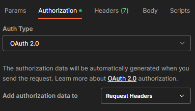
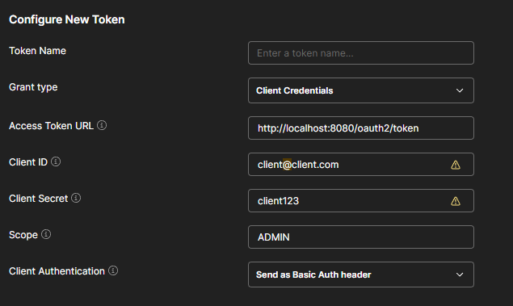
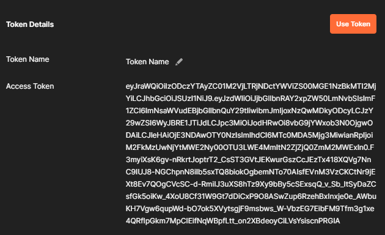
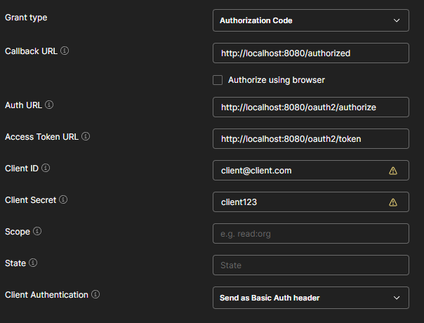
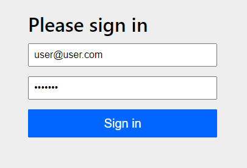

# Ev Charging API


Este projeto é um API de um sistema de carregamento de carros elétricos, com entidades que representam os usuários, a estação de carga e a sessão de carga de um veículo. Construída utilizando Java, Java Spring, PostgresSQL como banco de dados, Spring Security e JWT para controle de autenticação.


## Índice
- [Tecnologias](#tecnologias)
- [Instalação](#instalação)
- [Uso](#uso)
- [Documentação](#documentação)
- [EndPoints](#endpoints)
- [Autenticação](#autenticação)


## Tecnologias

- Java
- Spring Security
- Spring Data JPA
- Spring Web
- JWT
- Swagger API
- PostgresSQL
  
## Instalação

1. Clone o repositório:

```bash
git clone https://github.com/AugustoCedro/evcharging-api.git
```
2. Instale as dependências com o Maven

3. Instale [PostgresSQL](https://www.postgresql.org/)


## Uso

 1. Inicie a aplicação com o Maven
 2. A API estará disponível na url: http://localhost:8080

## Documentação

A documentação completa foi feita utilizando o Swagger.

ela pode ser encontrada na url: http://localhost:8080/swagger-ui/index.html#/


## EndPoints
Alguns EndPoints requerem um Usuário Logado. Para se autenticar olhe a sessão  [Autenticação](#autenticacao)

### Usuário

#### Retorna todos os Usuários - (ADMIN)

```
  GET /users
```
| Parâmetro   | Tipo       | 
| :---------- | :--------- | 
| `Id`      | `Long` |   
| `email`      | `String` |  

#### Salva um Usuário no banco

```
  POST /users
```
| Parâmetro   | Tipo       | Descrição       |
| :---------- | :--------- | :---------------|
| `email`     | `String` | **Obrigatório**.  |                              
| `password`   | `String` | **Obrigatório**. |

#### Deleta um Usuário do banco - (ADMIN)
```
  DELETE /users/{email}
```
| Parâmetro   | Tipo       | Descrição                                   |
| :---------- | :--------- | :------------------------------------------ |
| `email`      | `String` | **Obrigatório**. |

### Estação de Carga

#### Retorna todas as Estações de Carga - (ADMIN)
```
  GET /stations
```

#### Retorna todas as Estações de Carga disponíveis 
```
  GET /stations/available
```
#### Altera a disponibilidade de uma Estação de Carga - (ADMIN)
```
  PUT /stations/{id}
```
| Parâmetro   | Tipo       | Descrição                                   |
| :---------- | :--------- | :------------------------------------------ |
| `id`      | `Long` | **Obrigatório**. |

#### Salva uma Estação de Carga no banco - (ADMIN)
```
  POST /stations
```
| Parâmetro   | Tipo       | Descrição          |
| :---------- | :--------- | :------------------|
| `location`      | `String` | **Obrigatório**. |                              
| `powerKw`      | `Double` | **Obrigatório**. |

### Sessão de Carga

#### Inicia uma sessão 
```
  POST /sessions/start
```
| Parâmetro   | Tipo       | Descrição          |
| :---------- | :--------- | :------------------|
| `stationId`      | `Long` | **Obrigatório**. |                              
| `userEmail`      | `String` | **Obrigatório**. 

#### Inicia uma sessão 
```
  POST /sessions/end/{id}
```
| Parâmetro   | Tipo       | Descrição          |
| :---------- | :--------- | :------------------|
| `Id`      | `Long` | **Obrigatório**. |                              

#### Retorna todas as Sessões - (ADMIN)
```
  GET /stations/available
```
| Parâmetro   | Tipo       | 
| :---------- | :--------- | 
| `Id`      | `Long` | 
| `stationId`      | `Long` |      
| `userEmail`      | `String` |         


## Autenticação

A autenticação é feita utilizando OAuth2 e Tokens JWT, a API possui um Authorization Server e um Resource Server.

### Usuários Válidos
 - User:   
email: user@user.com            
senha: user123
 - Admin:   
 email: admin@admin.com  
 senha: admin123
 - Auth_Client:   
  clientId: client@client.com  
  clientSecret: client123


### Autenticação via Client Credentials
1. Abra o postman

2. selecione Authorization e depois selecione Auth Type: OAuth 2.0  


4. Coloque o Grant type - Client Credentials e preencha os dados como na imagem:


5. Clique para gerar um TOKEN de acesso e utilize ele para fazer as requisições.


### Autenticação via Authorization Code
1. Abra o postman
 
2. selecione Authorization e depois selecione Auth Type: OAuth 2.0    


3. Coloque o Grant type - Authorization Code e preencha os dados como na imagem:


4. Clique para gerar um TOKEN de acesso e a aplicação irá redirecionar para uma página de Login.


5. Insira um Usuário válido e pegue seu TOKEN de acesso e utilize ele para fazer as requisições.


